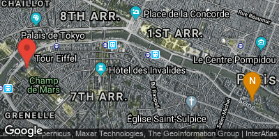
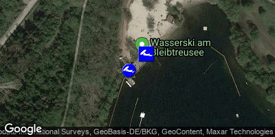
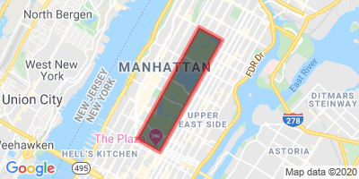

# :round_pushpin: google-static-map-creator

Java-API for creating static Google Maps links. [Static Maps API v2 Docs](https://developers.google.com/maps/documentation/maps-static/dev-guide)

Features:
- type safety
- polyline encoding (comes with a built-in compressor to satisfy Google Map URLs' length limitations)
- URL encoding
- validations (e.g. you cannot add more than 15 geocoded markers to one map) 

Disclaimer: This is a 3rd-party library without affiliations with Google.

## Quick Start

Add this dependency to your pom.xml (artifact available at Maven Central):

```
<!-- https://mvnrepository.com/artifact/de.pentabyte/google-static-map-creator -->
<dependency>
    <groupId>de.pentabyte</groupId>
    <artifactId>google-static-map-creator</artifactId>
    <version>2.3.0</version>
</dependency>
```

Get yourself an API key for the *Maps Static API* from [Google API Dashboard](https://console.cloud.google.com/apis/).

Now you are ready to create map urls by calling _de.pentabyte.googlemaps.StaticMap.toString()_.

## Examples

The rest of this document is a list of examples. You will see the source code and the resulting Google Map image. Please note: the Google Maps images have been downloaded from Google for documentation purposes only. They are copyrighted by Google and you cannot use them in any other way.

### Location

Just present a location without any markers or polylines.

```java
StaticMap map = new StaticMap(400, 200, APIKEY);
map.setLocation("Eiffeltower", 16);
map.setMaptype(Maptype.hybrid);
```


_map.toString():_ `https://maps.googleapis.com/maps/api/staticmap?size=400x200&center=Eiffeltower&zoom=16&maptype=hybrid&key=*****`

### Markers

If there is more than one annotation present, the map's center and zoom will be set automatically.

```java
StaticMap map = new StaticMap(400, 200, googleApiKey);
map.setMaptype(Maptype.hybrid);

map.addMarker(new StaticMarker("Eiffeltower"));

StaticMarker notreDame = new StaticMarker(48.853000, 2.349983);
notreDame.setLabel('N');
notreDame.setColor(StaticColor.orange);
map.addMarker(notreDame);
```


_map.toString():_ `https://maps.googleapis.com/maps/api/staticmap?size=400x200&maptype=hybrid&markers=Eiffeltower&markers=color:orange%7Clabel:N%7C48.853%2C2.349983&key=*****`

### Custom Markers

```java
StaticMap map = new StaticMap(400, 200, APIKEY);
map.setMaptype(Maptype.hybrid);

StaticMarker m1 = new StaticMarker(50.844943, 6.856998);
m1.setCustomIconUrl("http://cableparks.info/poi.png");
m1.setScale(2);
map.addMarker(m1);

StaticMarker m2 = new StaticMarker(50.844782, 6.856730);
m2.setCustomIconUrl("http://cableparks.info/poi_2.png");
m2.setScale(2);
map.addMarker(m2);
```


_map.toString():_ `https://maps.googleapis.com/maps/api/staticmap?size=400x200&maptype=hybrid&markers=scale:2%7Cicon:http:%2F%2Fcableparks.info%2Fpoi.png%7C50.844944%2C6.856998&markers=scale:2%7Cicon:http:%2F%2Fcableparks.info%2Fpoi_2.png%7C50.844784%2C6.85673&key=*****`

### Encoded Polyline

```
List<StaticLatLon> coords = new ArrayList<>();
coords.add(new StaticLatLonImpl(40.800568, -73.958185));
coords.add(new StaticLatLonImpl(40.796855, -73.949294));
coords.add(new StaticLatLonImpl(40.764311, -73.973011));
coords.add(new StaticLatLonImpl(40.768060, -73.981840));
coords.add(new StaticLatLonImpl(40.800568, -73.958185));
StaticPath centralPark = new StaticPath(coords);
centralPark.setColor(StaticColor.red);
centralPark.setFillColor("black");

StaticMap map = new StaticMap(400, 200, googleApiKey);
map.addPath(centralPark);
```


_map.toString():_ `https://maps.googleapis.com/maps/api/staticmap?size=400x200&path=color:red%7Cfillcolor:black%7Cenc:oz_xFr%7DkbMdVqv@jjEfsCmVdv@cjE%7BrC&key=*****`

### References

* The group event planning platform [GroupEvent.info](https://groupevent.info) uses the google-static-map-creator to render multiple non-interactive maps on one page for browser performance reasons. 
