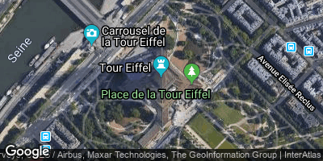

# google-static-map-creator

Provides a Java-API for creating static Google Maps links. [see Static Maps API v2 Docs](https://developers.google.com/maps/documentation/maps-static/dev-guide)

Features:
- easy to use and type safe
- polyline encoding (comes with a built-in compressor to satisfy Google Map URLs' length limitations)
- URL encoding
- validations (e.g. you cannot add more than 15 geocoded markers to one map) 

Disclaimer: This is a 3rd-party library without affiliations with Google.

## Quick Start

Add this dependency to your pom.xml (artifact available at Maven Central):

```
<dependency>
	<groupId>de.pentabyte</groupId>
	<artifactId>google-static-map-creator</artifactId>
	<version>2.0</version>
</dependency>
```

Get yourself an API key for the *Maps Static API* from [Google API Dashboard](https://console.cloud.google.com/apis/).

Now you are ready to create map urls by calling _de.pentabyte.googlemaps.StaticMap.toString()_.

## Examples

Disclaimer: The downloaded Google maps are for documentation purposes only. They are copyrighted by Google and must not be used in any other context than this README file.

### Location

Just present a location without any markers or polylines.

```java
StaticMap map = new StaticMap(400, 200, googleApiKey);
map.setLocation("Eiffeltower", 16);
map.setMaptype(Maptype.hybrid);
```
<table>
	<tr>
		<td>
			
		</td>
		<td>Source: `https://maps.googleapis.com/maps/api/staticmap?size=400x200&center=Eiffeltower&zoom=16&maptype=hybrid&key=YOUR-API-KEY`
		</td>
	</tr>
</table>

### Markers

If there is more than one annotation present, the map's center and zoom will be set automatically.

```java
StaticMap map = new StaticMap(400, 200, googleApiKey);
map.setMaptype(Maptype.hybrid);

List<StaticMarker> markers = new ArrayList<>();
markers.add(new StaticMarker("Eiffeltower"));

StaticMarker notreDame = new StaticMarker(48.853000, 2.349983);
notreDame.setLabel('N');
notreDame.setColor("orange");
markers.add(notreDame);

map.setMarkers(markers);
```


Source: `https://maps.googleapis.com/maps/api/staticmap?size=400x200&maptype=hybrid&markers=Eiffeltower&markers=color%3Aorange%7Clabel%3AN%7C48.853%2C2.349983&key=YOUR-API-KEY` |

### Custom Markers

```java
StaticMap map = new StaticMap(400, 200, googleApiKey);
map.setMaptype(Maptype.hybrid);

StaticMarker m1 = new StaticMarker(50.844943, 6.856998);
m1.setCustomIconUrl("http://cableparks.info/poi.png");
map.addMarker(m1);

StaticMarker m2 = new StaticMarker(50.844782, 6.856730);
m2.setCustomIconUrl("http://cableparks.info/poi_2.png");
map.addMarker(m2);
```

|  | `https://maps.googleapis.com/maps/api/staticmap?size=400x200&maptype=hybrid&markers=icon%3Ahttp%3A%2F%2Fcableparks.info%2Fpoi.png%7Cscale%3A2%7C50.844944%2C6.856998&markers=icon%3Ahttp%3A%2F%2Fcableparks.info%2Fpoi_2.png%7Cscale%3A2%7C50.844784%2C6.85673&key=YOUR-API-KEY` |